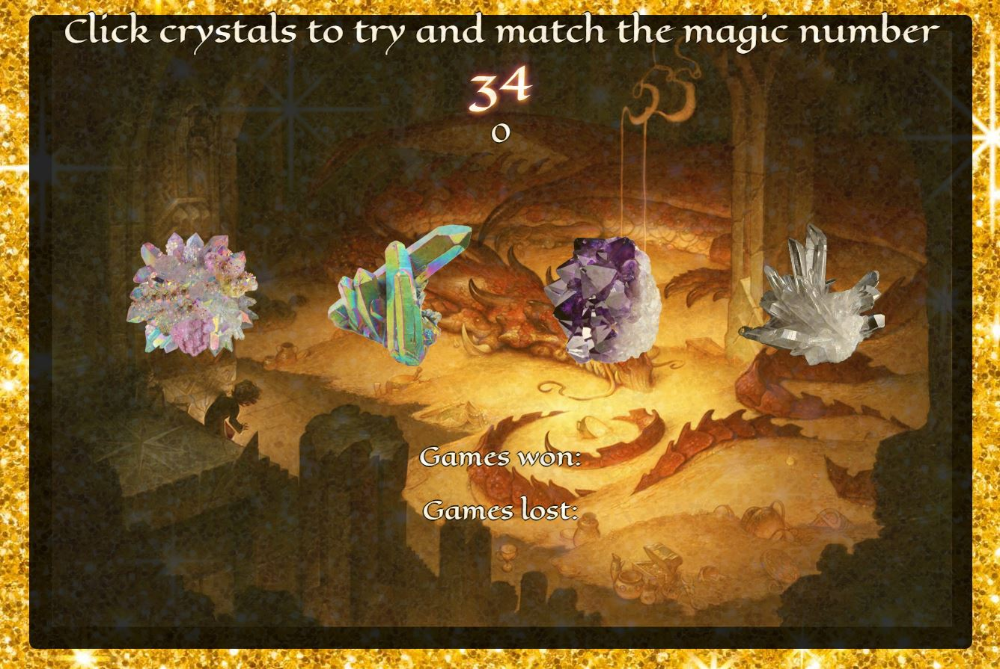

# Smaug's Treasure Hoard #
### A Crystals Collector Game ###
*UCF Bootcamp Assignment Week 4*

In this Game, the user must click crystals in an effort to match their score to the magic number displayed on the page. When the user has matched the magic number, the game will reset and the win will be recorded.  If the user goes higher than the magic number, the game will reset and  loss is tallied.

*Have fun and get clicking!*

Play the game: 
[Smaug's Treasure Hoard!](https://lamepixie.github.io/Smaugs_CrystalCollector/)

